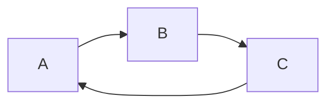

## flowchart

```flow
st=>start: Improve your
l10n process!
end=>end: Continue to have fun!
op1=>operation: Go to locize.com
sub1=>subroutine: Read the awesomeness
cond1=>condition: Interested to
getting started?
sub2=>subroutine: Read about improving
your localizatin workflow
or another source
io1=>inputoutput: Register
op2=>operation: Login
cond2=>condition: valid password
cond3=>condition: reset password
sub3=>subroutine: Create a demo project
sub4=>subroutine: start your real project
io2=>inputoutput: Subscribe
op3=>operation: send email

st->op1->sub1->cond1
cond1(yes)->io1->op2->cond2
cond1(no)->sub2(bottom)->op1
cond2(yes)->sub3->sub4->io2->end
cond2(no)->cond3
cond3(yes,right)->op3->op2
cond3(no)->op2

st@>op1({"stroke":"Red"})@>sub1({"stroke":"Red"})@>cond1({"stroke":"Red"})@>io1({"stroke":"Red"})@>op2({"stroke":"Red"})@>cond2({"stroke":"Red"})@>sub3({"stroke":"Red"})@>sub4({"stroke":"Red"})@>io2({"stroke":"Red"})@>end({"stroke":"Red","stroke-width":6,"arrow-end":"classic-wide-long"})

```

## sequence

```sequence{theme=hand}
Title: Here is a title
A->B: Normal line
B-->C: Dashed line
C->>D: Open arrow
D-->>A: Dashed open arrow
```

## Mermaid

